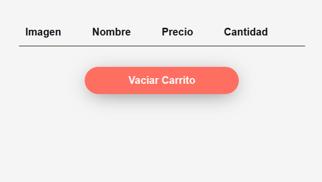
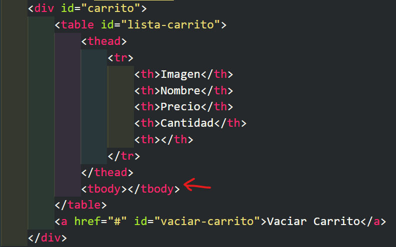
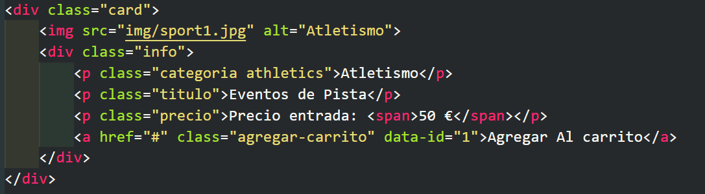
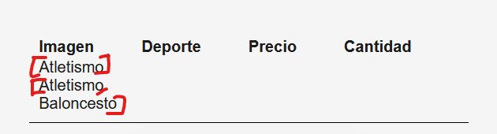

# Objetivo del proyecto

Es hora de aplicar los conceptos aprendidos hasta ahora, para ello vamos a ver paso a paso como crear un carrito de compras y añadir productos de forma dinámica. Hay que tener en cuenta que el objetivo principal es repasar especialmente, la **_manipulación del DOM_**, **_manejo de eventos_** y uso de **_funciones_**, así como ir entendiendo la lógica de negocio.

## Desarrollo del proyecto

La explicación será paso a paso, se puede seguir la evolución de todas las partes siguiendo el historial de **_commits_**.

## Primer Paso: Entendiendo el proyecto

Inicialmente tenemos un carrito de compras que está vacío.



En esta tabla debemos ir añadiendo productos a nuestro carrito cada vez que hagamos click en el botón agregar al carrito que tenemos en cada una de las card. Manejaremos la información como un objeto del cual obtendremos datos que añadiremos de forma dinámica al cuerpo de la tabla con identificador **_"lista-carrito"_** de nuestro documento **_HTML_**.



Lo primero que vamos a hacer es crear unas variables para poder acceder a la parte del HTML que nos interesa:

```javascript
const carrito = document.querySelector("#carrito");
const contenedorCarrito = document.querySelector("#lista-carrito tbody");
const vaciarCarritoBtn = document.querySelector("#vaciar-carrito");
const listaEventos = document.querySelector("#lista-eventos");
```

Una vez que tenemos las variables declaradas, vamos a crear una función que nos permita registrar todos los **_Event Listeners_**. Y dentro de la función, manejaremos un evento que al hacer click en el botón agregar al carrito, nos añada el evento deportivo al carrito.

```javascript
cargarEventListeners();
function cargarEventListeners() {
  listaEventos.addEventListener("click", agregarEvento);
}

function agregarEvento() {
  console.log("Presionando en evento");
}
```

Por el momento, tenemos una función que al hacer click nos muestra en la consola el mensaje **_presionando en evento_**, pero tenemos un problema. El evento se dispara en cualquier parte del contenido de la lista de eventos. Habíamos visto el concepto de event bubbling, es decir, se está propagando el evento de una forma que no queremos, ya que nos interesa que solo se ejecute la función **_agregarEvento()_** al pulsar en el botón que queremos manipular.

Si modificamos ligeramente la función **_agregarEvento()_**, podemos saber la clase del elemento sobre el que estamos haciendo click, y esto nos va a facilitar la tarea.

```javascript
function agregarEvento(e) {
  console.log(e.target.classList);
}
```

Por lo tanto, el objetivo es ejecutar la función solo cuando pulsemos sobre el elemento que contiene la clase **_agregar-carrito_**. Para ello, utilizaremos una sentencia de control que nos verifique que estamos haciendo click únicamente sobre ese elemento.

Observa, que elemento tiene una apariencia de botón, pero el elemento HTML es una etiqueta **_<a></a>_** y que cuando hacemos click, la pantalla se situa en la parte de arriba, por lo tanto debemos, evitar ese comportamiento que tienen los enlaces por defecto (es decir, redirigirnos al enlace correspondiente). Para ello usamos el método **_preventDefault()_**

```javascript
function agregarEvento(e) {
  e.preventDefault();
  if (e.target.classList.contains("agregar-carrito")) {
    console.log("Agregando al carrito");
  }
}
```

Ahora, ya sabemos que nos estamos comunicando correctamente con el elemento que queremos, vamos a utilizar los conceptos aprendidos en **_"traversing the DOM"_** para recorrer el HTML y extraer la información que nos interesa para poder generar el HTML y que se muestre en el carrito.

## Segundo paso: Leer los datos del evento que seleccionamos.

El objetivo de este paso es leer el contenido del HTML al que le dimos click y extraer la información del evento que estamos añadiendo al carrito.



Si observamos nuestro documento, tenemos que nuestro elemento que contiene la clase **_agregar-carrito_** esta dentro del elemento con clase **_info_** y a su vez dentro de un elemento con la clase **_card_**. Es de este elemento del que vamos a querer extraer la información que queremos añadir al carrito y para poder seleccionar este elemento, podemos utilizar **_parentElement_**, que tendremos que usar 2 veces, para ubicarnos en el lugar correcto. Vamos a comprobar que estamos en el lugar del documento correcto, modificando la función **_agregarEvento()_** y cuando hagamos click, llamaremos a la función que leerá los datos del elemento en el que nos encontramos, y lo más importante, sabremos que estamos situados en la parte correspondiente.

```javascript
function agregarEvento(e) {
  e.preventDefault();
  if (e.target.classList.contains("agregar-carrito")) {
    console.log(e.target.parentElement.parentElement);
    leerDatosEvento();
  }
}
```

A continación, vamos a mejorar un poco el código almacenando en una variable el evento seleccionado. Como ya sabemos que cuando hacemos click en cualquiera de los botones, nos selecciona el elemento que queremos, debemos pasar como argumento el curso seleccionado a la función **_leerDatosEvento()_**.

```javascript
function agregarEvento(e) {
  e.preventDefault();
  if (e.target.classList.contains("agregar-carrito")) {
    const eventoSeleccionado = e.target.parentElement.parentElement;
    leerDatosEvento(eventoSeleccionado);
  }
}
```

Ahora, sabemos que la función **_leerDatosEvento()_** va a recibir un parámetro que podemos llamar como queramos. Y vamos a hacer que se muestre por consola el HTML que hemos seleccionado.

```javascript
function leerDatosEvento(eventoEscogido) {
  console.log(eventoEscogido);
}
```

Antes de continuar, vamos a hacer un resumen de lo que hace nuestro código hasta ahora:

1. Cuando se dispara el evento (en nuestro caso, un click) y agregarEvento es llamada, la función recibe el evento como e.
2. e.preventDefault() detiene la acción predeterminada del elemento.
3. Si el elemento en el que se hizo click (e.target) tiene la clase **_agregar-carrito_**, el código selecciona el elemento abuelo de e.target.
4. eventoSeleccionado (el elemento abuelo) se pasa a la función leerDatosEvento.
5. leerDatosEvento toma eventoSeleccionado y lo imprime en la consola del navegador.

Esto permite capturar y manipular un elemento específico del DOM cuando ocurre un evento, y luego podemos usar esa información para realizar otras acciones.

Para finalizar, vamos a crear un objeto con el contenido del evento actual.

```javascript
const infoEvento = {
  imagen: eventoEscogido.querySelector("img").src,
  deporte: eventoEscogido.querySelector(".titulo").textContent,
  precio: eventoEscogido.querySelector(".precio span").textContent,
  id: eventoEscogido.querySelector("a").getAttribute("data-id"),
  cantidad: 1,
};
console.log(infoEvento);
```

Hemos creado un objeto con la información que nos interesa. Por un lado la ruta de la imagen, que utilizaremos para mostrar una miniatura en el carrito, el evento deportivo seleccionado, el precio de la entrada, un id que necesitaremos para identificar cada entrada que compramos y por defecto, asignaremos una cantidad inicial de 1, que posteriormente incrementaremos.

## Tercer paso: Mostrar los datos del evento que seleccionamos en el carrito.

Ahora que ya somos capaces de crear un objeto que contiene toda la información que queremos, vamos a crear un **_array_** para ir almacenando cada uno de los objetos que seleccionemos. Como al iniciar la página, no hemos seleccionado ningún artículo para añadir al carrito, nuestro array, al igual que el carrito, estará vacío.

```javascript
let articulosCarrito = [];
```

Una vez seleccionado un evento deportivo, iremos añadiendo el objeto con la información a nuestro array. Como no podemos perder la referencia que teníamos, tenemos que hacer una "copia" de nuestro array cada vez que añadimos artículos al carrito. Podemos usar el método **_push_** de los arrays, pero vamos a utilizar el **_spread operator_**.

```javascript
articulosCarrito = [...articulosCarrito, infoEvento];
console.log(articulosCarrito);
```

De esta forma, cada vez que seleccionamos un artículo, tendremos el array que teníamos con los artículos seleccionados previamente más el que hemos seleccionado ahora.

Ahora, lo que nos interesa es que se muestre esta información en nuestra aplicación. Para ello, vamos a crear una función que vamos a llamar **_carritoHTML_** que se encargue de "pintar" el HTML de forma dinámica cada vez que seleccionamos un artículo. Esta función, la invocaremos cade vez que hagamos click en el elemento con la clase **_"agregar-carrito"_**. Por lo tanto, debemos llamarla dentro de la función **_leerDatosEvento()_**.

```javascript
function carritoHTML() {
  articulosCarrito.forEach((evento) => {
    const row = document.createElement("TR");
    row.innerHTML = `
        <td>
            ${evento.deporte}
        </td>
        `;
  });
}
```

Como articulosCarrito es un array, debemos iterar sobre cada elemento del array (recordemos que es un array de objetos) y por cada elemento del array, vamos a crear una etiqueta en el HTML de tipo **_<tr>_** y para cada una de ellas, vamos a acceder dentro del HTML y añadir el evento deportivo que estamos seleccionando.

Una vez, iterado sobre nuestro array **_articulosCarrito_** vamos a añadirlo al **_contenedorCarrito_** que ya teníamos seleccionado en una variable y para "pintarlo" usamos el método **_appendChild_** en nuestra función **_carritoHTML()_**.

```javascript
contenedorCarrito.appendChild(row);
```

Si observamos, nuestro carrito, ya se empieza a llenar con la información que queremos, pero hay que tener en cuenta varias consideraciones. Para empezar, estamos añadiendo el nombre del evento deportivo en la parte izquierda de la tabla y la función **_carritoHTML()_** va a pintar el array de artículos cada vez que seleccionamos un artículo. El problema es que cuando lo hacemos la primera vez, en nuestro carrito tenemos un artículo y lo pinta. Si seleccionamos otro artículo, en el HTML aparece el array que teníamos con un artículo y pintará el nuevo array, que ahora tiene 2 artículos.



Por lo tanto, debemos limpiar el HTML anterior antes de crear el nuevo, para que solo nos muestre los artículos de la última selección sin repetir los anteriores. Para ello, vamos a crear una nueva función que eliminará los artículos anteriores y que invocaremos en nuestro carrito antes de recorrer el array de artículos y generar el nuevo HTML. Esto lo podemos hacer de diversas formas. Podemos hacer la limpieza de una forma lenta y sin complicaciones que va a funcionar sin problema, que es la siguiente:

```javascript
function limpiarHTML() {
  contenedorCarrito.innerHTML = "";
}
```

Existe una forma más óptima de hacer esta limpieza usando una sentencia de control **_while_**.

```javascript
while (contenedorCarrito.firstChild) {
  contenedorCarrito.removeChild(contenedorCarrito.firstChild);
}
```

¿Qué hace este código? Recordemos que **_while_** es un bucle que se ejecutará mientras se cumpla una condición. En este caso la condición **_contenedorCarrito.firstChild_** verifica si **_contenedorCarrito_** tiene al menos un hijo (es decir, un elemento dentro de él). Si se cumple, el bucle continúa.

Al cumplirse, se ejecutará una instrucción a la cual le estamos diciendo que a contenedorCarrito se le elimine un elemento hijo **_(contenedorCarrito.removeChild())_** y le decimos que elemento queremos eliminar, en este caso el primero **_(contenedorCarrito.firstChild)_**.

Esto se repetirá hasta que no quede ningún hijo en **_contenedorCarrito_**.

## Cuarto Paso: Mostrar el resto de la información.

Para mostrar el HTML de los elementos que faltan, dentro de nuestro **_"template literal"_** de la función **_carritoHTML()_** añadiremos las etiquetas que faltan, teniendo en cuenta el orden en el que queremos que se muestren. Quedando de este modo:

```javascript
articulosCarrito.forEach(evento => {
        const row = document.createElement('TR');
        row.innerHTML = `
        <td>
            
        </td>
        <td>
            ${evento.deporte}
        </td>
        <td>
            ${evento.precio}
        </td>
        <td>
            ${evento.cantidad}
        </td>
        `;
```

Si nos fijamos en el **_index.html_** en la cabecera de la tabla, habíamos dejado una celda vacía. Esta la vamos a aprovechar para poder elminar un objeto de la lista de arrays de forma dinámica.

```html
<thead>
  <tr>
    <th>Imagen</th>
    <th>Deporte</th>
    <th>Precio</th>
    <th>Cantidad</th>
    <th></th>
  </tr>
</thead>
```

Así que vamos a modificar de nuevo el template literal para añadir un elemento que nos permita eliminar un curso que estará identificado mediante su id.

```javascript
articulosCarrito.forEach(evento => {
        const row = document.createElement('TR');
        row.innerHTML = `
        <td>
            
        </td>
        <td>
            ${evento.deporte}
        </td>
        <td>
            ${evento.precio}
        </td>
        <td>
            ${evento.cantidad}
        </td>
        <td>
            <a href="#" class="borrar-evento" data-id="${evento.id}">X</a>
        </td>
        `;
```

Ahora que ya vemos, que el código funciona, podemos mejorarlo. Para ello, vamos a repasar un concepto que habíamos visto que es destructuring para renombrar nuestras variables. Así que nuestro código ahora es:

```javascript
articulosCarrito.forEach(evento => {
        const {imagen, deporte, precio, cantidad, id} = evento
        const row = document.createElement('TR');
        row.innerHTML = `
        <td>
            
        </td>
        <td>
            ${deporte}
        </td>
        <td>
            ${precio}
        </td>
        <td>
            ${cantidad}
        </td>
        <td>
            <a href="#" class="borrar-evento" data-id=${id}>X </a>
        </td>
        `;
```

## Quinto Paso: Actualizar la cantidad de elementos si el elemento ya existe.

Llegados a este punto, vemos que ya se muestra en el carrito todo lo que necesitamos, pero todavía presenta problemas. En este punto, vemos que si alguien selecciona 2 veces el mismo curso, se añade 2 veces en vez de actualizarse la cantidad. Vamos a ver como solucionarlo.

Podemos verificar antes de agregar elementos al array de artículos si ese artículo ya está presente en el carrito. Si ya existe, actualizaremos la cantidad y si no existe, entonces lo añadiremos al carrito. Mediante el método de arrays **_some_** podemos comparar el id del evento seleccionado con el id de los objetos que contiene la información del array del carrito.

```javascript
const existe = articulosCarrito.some(
  (eventoEscogido) => eventoEscogido.id === infoEvento.id
);
console.log(existe);
```

Podemos verificar lo que ocurre mostrandolo en la consola. Si nos devuelve un **_false_**, ese evento seleccionado no existe y si nos devuelve **_true_**, es que ya existe. Entonces podemos manejar una sentencia de control que verifique si el elemento existe y en este caso actualizar la cantidad y si no existe, agregar el curso al carrito.

```javascript
if (existe) {
  // Actualizamos la cantidad
} else {
  // Agregaremos el curso al carrito
}
```

Para actualizar la cantidad, debemos iterar sobre todos los objetos del array, verificar cuál se repite y actualizar la cantidad. Para ello, vamos a usar el método **_map()_** que nos devolverá un nuevo array que hemos llamado **_eventos_**. Si el id del eventoEscogido coincide con un id de algún artículo del carrito, incrementará su cantidad en 1 y devolverá el objeto actualizado. Si no coincide, devuelve el objeto tal y como está (ya que no queremos perder ese artículo del carrito). Copiamos el array eventos en el array del carrito.

Si el elemento seleccionado no está en el carrito es el código que teníamos anteriormente.

```javascript
// Revisa si un elemento ya existe en el carrito
const existe = articulosCarrito.some(
  (eventoEscogido) => eventoEscogido.id === infoEvento.id
);
if (existe) {
  // Actualizamos la cantidad
  const eventos = articulosCarrito.map((eventoEscogido) => {
    if (eventoEscogido.id === infoEvento.id) {
      eventoEscogido.cantidad++;
      return eventoEscogido; // devuelve el objeto actualizado
    } else {
      return eventoEscogido; // devuelve los objetos que no son utilizados
    }
  });
  articulosCarrito = [...eventos];
} else {
  // Agregar elementos al array de carrito
  articulosCarrito = [...articulosCarrito, infoEvento];
}
```

## Sexto Paso: Eliminar un artículo del carrito.

Para eliminar un curso, debemos crear un nuevo evento, que al hacer click, dispare la función que vamos a crear ahora para eliminar un artículo del carrito.

```javascript
carrito.addEventListener("click", eliminarEvento);
```

Para crear la función podemos apoyarnos en las clases, para saber que clase tiene el elemento sobre el que estamos haciendo click;

```javascript
function eliminarEvento(e) {
  console.log(e.target.classList);
}
```

En este caso, cuando pulsamos sobre el botón para eliminar cada uno de los artículos, el **_console.log()_** nos ayuda a identificar que estamos pulsando sobre un elemento cuya clase es **_"borrar-evento"_**.
Entonces, si existe existe este elemento, vamos a obtener su id.

```javascript
function eliminarEvento(e) {
  console.log(e.target.classList);
  if (e.target.classList.contains("borrar-evento")) {
    const eventoId = e.target.getAttribute("data-id");
  }
}
```

Ahora debemos eliminar de nuestro array solo los artículos que tengan ese id, manteniendo el resto. Podemos hacerlo de distintas formas, pero una muy común es usando el método **_filter_** y volver a traernos todos los elementos que no coincidan con el id que queremos eliminar.

```javascript
function eliminarEvento(e) {
  console.log(e.target.classList);
  if (e.target.classList.contains("borrar-evento")) {
    const eventoId = e.target.getAttribute("data-id");
    // Eliminar del array articulosCarrito por el data-id
    articulosCarrito = articulosCarrito.filter(
      (evento) => evento.id !== eventoId
    );
    console.log(articulosCarrito);
  }
}
```

En la consola, ya estamos viendo que funciona todo correctamente y solo nos queda por volver a "pintar el HTML" con esta actualización llamando a la función **_carritoHTML()_**.

```javascript
function eliminarEvento(e) {
  if (e.target.classList.contains("borrar-evento")) {
    const eventoId = e.target.getAttribute("data-id");
    // Eliminar del array articulosCarrito por el data-id
    articulosCarrito = articulosCarrito.filter(
      (evento) => evento.id !== eventoId
    );
    carritoHTML(); // Iterar de nuevo sobre el carrito y mostrar su HTML
  }
}
```

## Séptimo Paso: Vaciar por completo el carrito.

En este caso, añadiremos un nuevo evento de escucha que al hacer click, nos vacíe por completo el carrito. Como el código a añadir es pequeño, haremos uso de una función anónima.

```javascript
vaciarCarritoBtn.addEventListener("click", () => {
  console.log("vaciando carrito...");
});
```

En este caso, debemos hacer dos cosas, por un lado dejar vacío nuestro array de artículos y por otro limpiar el HTML para que nos muestre el carrito de nuevo vacío.

```javascript
vaciarCarritoBtn.addEventListener("click", () => {
  articulosCarrito = []; //reseteamos el array
  limpiarHTML(); //Eliminamos todo el HTML
});
```
Ya tenemos completo nuestro primer mini proyecto. Se pueden añadir más funcionalidades a nuestro carrito, como calcular el total. Ese es un ejercicio extra que os dejo a vosotros.

## Paso extra: añadir localStorage al proyecto.
