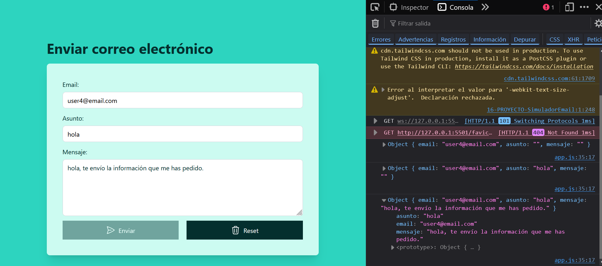

# Objetivo del proyecto

Después de haber creado el primer proyecto, vamos a afianzar conceptos mediante un nuevo proyect. En este caso, vamos a simular el envío de correos electrónicos mediante un formulario. Repasaremos de nuevo la **_manipulación del DOM_**, **_manejo de eventos_** y uso de **_funciones_** para que podamos ir asentando las bases al respecto. Además, ampliaremos lo visto en el proyecto anterior, y aprenderemos como **validar un formulario** y usaremos algún concepto del que no hemos hablado hasta ahora como son las **expresiones regulares**.

## Desarrollo del proyecto

La explicación será paso a paso, se puede seguir la evolución de todas las partes siguiendo el historial de **_commits_**. Hay algo que debemos tener en cuenta en este proyecto, y es el uso de **_TAILWINDCSS_** que he aplicado a los estilos, ya que no se trata de un repositorio en el que el diseño sea lo preferente. Por eso, he elegido esta librería de estilos que nos permite tener una apariencia vistosa y moderna, pero que no nos robará mucho tiempo, ya que el objetivo es aprender **_JAVASCRIPT_**.

## Primer Paso

Para comenzar, queremos que se ejecute nuestro código una vez cargado todo el documento HTML, así que crearemos un evento que permita la ejecución de todo el código al iniciar:

```javascript
document.addEventListener("DOMContentLoaded", function () {});
```

Dentro de este evento, vamos a seleccionar los elementos de la interfaz que vamos a querer manipular y validar mediante **_JavaScript_** mediante el uso de los selectores correspondientes:

```javascript
document.addEventListener("DOMContentLoaded", function () {
  const inputEmail = document.querySelector("#email");
  const inputAsunto = document.querySelector("#asunto");
  const inputMensaje = document.querySelector("#mensaje");
});
```

## Segundo paso: añadir eventos para validar un formulario.

Llegados a este punto, tenemos que añadir los eventos para poder "escuchar" lo que hace el usuario cuando está rellenando la información. Lógicamente, estos eventos, deben ser congruentes con lo que queremos escuchar. No tiene sentido escuchar cuando un usuario hace click en un campo del formulario, pero si cuando está escribiendo o cuando cambia de campo.

Uno de los eventos que se utilizan en la validación de formularios es **_blur_**:

```javascript
inputEmail.addEventListener("blur", function () {
  console.log("Salí del input");
});
```

En este caso, añadimos un **_Evento de escucha_** al campo Email de tipo **_"blur"_**. Cuando el usuario, pierda el foco en este campo, es decir, cuando el usuario cambie a otro campo o haga click fuera del formulario, se ejecutará el código que tenemos en la función (en este caso el console.log())

Hay otro tipo de evento para validación de campos de formulario que es **_input_** que ejecutará la función mientras el usuario esté escribiendo en ese campo, pero no lo hace cuando el usuario pierda el foco en el campo.

Una vez que ya sabemos, que estamos "escuchando" el elemento del DOM que nos interesa, queremos averiguar lo que el usuario está escribiendo, por lo tanto debemos escuchar el valor de ese elemento.

```javascript
inputEmail.addEventListener("blur", function (e) {
  console.log(e.target.value);
});
```

Ahora, si escribimos algo en el campo Email, vemos como se muestra en la consola del navegador lo que estamos escribiendo.

Para el resto de campos que queremos validar, podríamos hacer exactamente lo mismo con el resto de las variables y funcionaría correctamente lo que estamos tratando de hacer.

```javascript
inputEmail.addEventListener("blur", function (e) {
  console.log(e.target.value);
});
inputAsunto.addEventListener("blur", function (e) {
  console.log(e.target.value);
});
inputMensaje.addEventListener("blur", function (e) {
  console.log(e.target.value);
});
```

## Tercer paso: crear una función para validar

Ya hemos visto que el código funciona correctamente hasta ahora, pero una buena práctica es refactorizar el código (en mi caso y en el de muchos programadores, cuando el código hace 3 veces lo mismo, se puede extraer a una función).

En este caso vamos a crear una función para validar los campos del formulario, por el momento nuestra función va a ser la siguiente (así comprobamos que funciona):

```javascript
function validar() {
  console.log("desde la función de validar");
}
```

Entonces, debemos modificar nuestros eventos, para que ejecuten la función **_validar()_** cada vez que se dispare ese evento.

```javascript
inputEmail.addEventListener("blur", validar);
inputAsunto.addEventListener("blur", validar);
inputMensaje.addEventListener("blur", validar);
```

**_IMPORTANTE: LA SINTAXIS ES SIN PARÉNTESIS _**
La sintaxis en este caso es el nombre de la función sin paréntesis, ya que queremos que se ejecute una vez lanzado el evento de escucha. Si le pusieramos los paréntesis, estaríamos invocando a la función y se ejecutaría cuando cargue el documento HTML (Recuerda, que estamos ejecutando nuestro código desde un evento de tipo 'DOMContentLoaded').

Para que nuestra función escuche el evento en cada campo debemos pasarlo como parámetro a la función. Esto hará que se ejecute el código dentro del elemento que corresponda cuando perdamos el foco en cada uno de los campos correspondientes.

```javascript
function validar(e) {
  console.log(e.target.value);
}
```

Ahora tenemos 3 eventos que utilizan la misma función que podemos reutilizar todas las veces que queramos.

## Cuarto paso: detectar si hay campos vacíos.

De forma sencilla, en un campo no hay nada escrito si el valor de ese campo es un **_string_** vacío. Por lo tanto, podemos utilizar una sentencia de control que nos diga que está vacío si no hay nada escrito y que nos diga que no lo está si hay algo escrito en ese input. Esto se puede hacer usando un **_IF...ELSE_**.

```javascript
function validar(e) {
  if (e.target.value === "") {
    console.log("Está vacío");
  } else {
    console.log("Hay algo escrito");
  }
}
```

Este código tiene un problema, si dentro de un campo pulsamos varias veces sobre la barra espaciadora y pasamos al siguiente campo, la consola nos muestra el mensaje de que hay algo escrito. Esto es debido a que los espacios en blanco son caracteres (recordar en el capítulo de strings que cuando contábamos caracteres los espacios en blanco cuentan).

Así que debemos añadir un método a la condición del IF que nos elimine los espacios en blanco al principio y final de cada campo (Ver método **_TRIM_**). Por lo tanto, nuestra validación ya se comporta como queremos:

```javascript
function validar(e) {
  if (e.target.value.trim() === "") {
    console.log("Está vacío");
  } else {
    console.log("Hay algo escrito");
  }
}
```

## Quinto paso: generar una alerta en la validación de campos vacíos.

Ahora que ya está funcionando nuestra validación de forma correcta, vamos a manipular el DOM para mostrar un mensaje al usuario y que sepa que el campo no puede estar vacío.

Podríamos escribir el código en el IF para que muestre al usuario un mensaje, pero en su lugar, vamos a crear una función para mostrar alertas (que invocaremos en esta parte), ya que nos va a permitir manejar distintos tipos de alerta y tendremos un código más reutilizable y limpio.

```javascript
function validar(e) {
  if (e.target.value.trim() === "") {
    mostrarAlerta();
  } else {
    console.log("Hay algo escrito");
  }
}

function mostrarAlerta() {
  console.log("Hubo un error...Está vacío");
}
```

Como el usuario no va a inspeccionar la consola, vamos a generar una alerta en el HTML utilizando scripting de JavaScript. Lo primero que vamos a hacer es crear un elemento de HTML, para ello, tenemos el método **_createElement()_** al que le pasaremos como parámetro cualquier etiqueta de HTML. (Como buena práctica, se recomienda escribir el nombre de la etiqueta con mayúsculas, pero en minúsculas funciona)

```javascript
const error = document.createElement("P");
```

Una vez creado el elemento HTML (en este caso un párrafo), accedemos a éste y podemos asignarle un texto.

```javascript
error.textContent = "Hubo un error";
console.log(error);
```

Es mejor usar textContent que innerHTML, ya que innerHTML no escapa los datos. Además, textContent genera un código más seguro.

## Sexto paso: inyectar la alerta en el HTML.

Ya vemos que tenemos la alerta en la consola, así que nos queda mostrarla en el HTML, para ello vamos a seleccionar la parte donde la vamos a mostar, así que vamos a crear una nueva variable en la que vamos a almacenar un nuevo selector y lo añadimos en la parte del código donde estamos creando esas variables.

```javascript
const formulario = document.querySelector("#formulario");
```

Vamos a usar este selector, para inyectar (que se muestre) el error en la pantalla. Para ello, vamos a usar **_appendchild_** que lo que hace es añadir un elemento como hijo al elemento que le estamos diciendo y en este caso lo estará haciendo al final.
Podríamos haber usado innerHTML, pero nos iba a sustituir todo el HTML del formulario y no nos interesa ese comportamiento.


Como este proyecto lo estamos haciendo con **_TAILWIND_** vamos a darle algunos estilos, para ello vamos a darle alguna clase en la función mostrarAlerta() de este modo:

```javascript
error.classList.add("bg-rose-500", "text-white", "p-2", "text-center");
```

## Séptimo paso: Personalización de errores.

Para personalizar cada uno de los mensaje, vamos modificar ligeramente nuestra función mostrarAlerta. Ahora, va a recibir un mensaje como parámetro. El mensaje que reciba como atributo cuando invocamos a la función es lo que se va a mostrar en pantalla.

```javascript
function validar(e) {
  if (e.target.value.trim() === "") {
    mostrarAlerta("El campo Email es obligatorio");
  } else {
    console.log("Hay algo escrito");
  }
}

function mostrarAlerta(mensaje) {
  // Generar una alerta en HTML
  const error = document.createElement("P");
  error.textContent = mensaje;
  error.classList.add("bg-rose-500", "text-white", "p-2", "text-center");

  // Inyectar el error al formulario
  formulario.appendChild(error);
}
```

El problema que tenemos ahora, es que da igual el campo que dejemos vacío, nos va a mostrar siempre el mismo mensaje. Pero cuando estamos validando un campo, podemos saber a que campo estamos accediendo mediante **_e.target_**. Hay un montón de atributos a los que podemos acceder dentro de cada input, así que vamos a usarlos para mostrar un mensaje más personalizado según el campo que dejemos vacío. En este caso, podemos usar el **_id, name u otro que nos permita averiguar cada campo_**.

Así que si reemplazamos el mensaje por:

```javascript
mostrarAlerta(`El campo ${e.target.name} es obligatorio`);
```

Nos mostrará ese mensaje de forma dinámica en función del nombre del input.

## Octavo paso: mostrar las alertas junto a su campo.

Vamos a modificar un poco el código para inyectar cada alerta cerca de su campo. Para ello, vamos a utilizar los conceptos vistos en **_traversing the DOM_**

Lo primero que tenemos que hacer es indicarle a la función mostrarAlerta que le vamos pasar como parámetro el lugar donde queremos inyectar el HTML de la alerta, es decir le vamos a indicar una referencia.

```javascript
function mostrarAlerta(mensaje, referencia) {
  // Generar una alerta en HTML
  const error = document.createElement("P");
  error.textContent = mensaje;
  error.classList.add("bg-rose-500", "text-white", "p-2", "text-center");

  // Inyectar el error al formulario
  formulario.appendChild(error);
}
```

Si nos fijamos en el HTML:


Podemos observar, que cada input está dentro de una div y es a esta div a la que queremos acceder, para ello podemos usar **_parentElement_** y esta es la referencia que le vamos a pasar a nuestra función como argumento dentro de nuestra función validar.

```javascript
function validar(e) {
  if (e.target.value.trim() === "") {
    mostrarAlerta(
      `El campo ${e.target.name} es obligatorio`,
      e.target.parentElement
    );
  } else {
    console.log("Hay algo escrito");
  }
}
```

Y en vez de inyectar el error en el formulario como lo hacíamos antes, lo vamos a hacer en esta referencia. Como la referencia es siempre en función del evento que está escuchando en cada uno de los campos, la alerta se va a colocar de forma correcta.


## Noveno paso: prevenir que se muestren múltiples alertas.

Llegados a este punto, podemos observar que si dejamos varias veces vacío el mismo campo, la alerta se genera varias veces. Vamos a ver como evitar este comportamiento.

Cuando generamos la alerta, le añadiamos una clase al elemento que habíamos creado, podemos apoyarnos en estas clases para saber si ya hay un elemento creado con esa clase y en caso de que lo hubiera no crear de nuevo la alerta. Por lo tanto, voy a añadir una nueva clase "msg-error" al elemento para poder identificarlo (podéis usar la que queráis siempre que sea única para los elementos que estamos creando y no esté presente en el resto del HTML):

```javascript
error.classList.add(
  "bg-rose-500",
  "text-white",
  "p-2",
  "text-center",
  "msg-error"
);
```

Ahora, dentro de nuestra función mostrarAlerta, vamos a comprobar si existe ese elemento y si la hay, la va a eliminar.

```javascript
const alerta = document.querySelector(".msg-error");
if (alerta) {
  alerta.remove();
}
```

Vemos que ya no duplica alerta, pero nos genera un problema. Está buscando en el documento la clase "msg-error" y la elimina cuando existe. Esto provoca que si cambiamos a otro campo, nos va quitar la alerta. Es decir, va a encontrar la alerta aunque no estemos en ese campo y la va a limpiar y lo que queremos es que se mantenga una sola vez hasta que pase la validación.

Lo que tenemos que hacer es esa limpieza cerca del input en el que estamos trabajando, así que si en vez de aplicarlo a todo el documento, le decimos que seleccione en la referencia que le estamos pasando, solo lo va a hacer ahí y no buscará en todo el documento.

```javascript
const alerta = referencia.querySelector(".msg-error");
```

## Décimo paso: ocultar alertas si pasa la validación.

Recordemos que hasta ahora tenemos esta función de validar

```javascript
function validar(e) {
  if (e.target.value.trim() === "") {
    mostrarAlerta(
      `El campo ${e.target.name} es obligatorio`,
      e.target.parentElement
    );
  } else {
    console.log("Hay algo escrito");
  }
}
```

En realidad, no necesitamos ese else. Si la función validar se encuentra con un campo vacío, podemos parar la ejecución y que no haga nada más, con lo que nos evitaremos una ejecución de código innecesario. Para hacer esto, usaremos la palabra reservada **_return_**. Nuestro código pasa a ser el siguiente:

```javascript
function validar(e) {
  if (e.target.value.trim() === "") {
    mostrarAlerta(
      `El campo ${e.target.name} es obligatorio`,
      e.target.parentElement
    );
    return;
  }
  console.log("después del IF");
}
```

Es decir, ahora tenemos una función validar que si encuentra un campo vacío, mostrará la alerta que corresponda y se parará ahí, ya no ejecutará más. Esto va a simplificar la lógica del código y será más fácil de mantener ya que usando **_IF_** tenemos un solo camino y si usaramos **_IF...ELSE_** tendríamos que manejar múltiples ramas de ejecución.

En este punto, y una vez comprobado que el campo no está vacío vamos a llamar a una función que se llama **_limpiarAlerta()_** que vamos a llamarla en la función **_validar()_** y crearla a continuación:

```javascript
function limpiarAlerta() {
  console.log("desde limpiar alerta");
}
```

Esta función solo se va a invocar en el caso de que pasemos la validación, por lo tanto si no dejamos vacío el campo, veremos en la consola el mensaje "desde limpiar alerta". Ahora, nos queda mucho más claro que si el campo está vacío, la función validar ejecutará la función mostrarAlerta, si no lo está ejecutará limpiarAlerta.

Puede ocurrir que tengamos alertas en distintos campos, por lo tanto, tenemos que pasarle la referencia de la alerta que tiene que eliminar. Al igual que en mostrarAlerta, le podemos pasar como argumento **_e.target.parentElement_** y así la función ya sabrá que alerta es la que queremos eliminar. Por lo tanto, podemos hacer exactamente los mismo que habíamos hecho cuando comprobábamos si ya existe una alerta.

```javascript
function limpiarAlerta(referencia) {
  const alerta = referencia.querySelector(".msg-error");
  if (alerta) {
    alerta.remove();
  }
}
```

Podemos observar, que si en el selector de la clase que llamamos alerta, cambiamos esa referencia por **_document_** puede parecer que el código también funciona, pero no es así, ya que en ese caso siempre va a eliminar el primer elemento que encuentre en el documento HTML con la clase **_msg-error_**.

Como tenemos el mismo código repetido en dos sitios distintos, podemos refactorizar y en mostrarAlerta, invocar a limpiarAlerta, ya que el código es el mismo, pasándole como argumento referencia.

Como recordatorio, en este punto tenemos 3 funciones:

```javascript
function validar(e) {
  if (e.target.value.trim() === "") {
    mostrarAlerta(
      `El campo ${e.target.name} es obligatorio`,
      e.target.parentElement
    );
    return;
  }
  limpiarAlerta(e.target.parentElement);
}

function mostrarAlerta(mensaje, referencia) {
  limpiarAlerta(referencia);
  // Generar una alerta en HTML
  const error = document.createElement("P");
  error.textContent = mensaje;
  error.classList.add(
    "bg-rose-500",
    "text-white",
    "p-2",
    "text-center",
    "msg-error"
  );
  // Inyectar el error al formulario
  referencia.appendChild(error);
}

function limpiarAlerta(referencia) {
  // Comprobar si ya existe una alerta
  const alerta = referencia.querySelector(".msg-error");
  if (alerta) {
    alerta.remove();
  }
}
```

## Undécimo paso: validar un email con una expresión regular.

Hasta este paso, la validación de nuestro formulario va tomando forma, vemos que si los campos están vacíos, se muestran las alertas, que no se repiten dos veces en el mismo campo y que se eliminan si los campos no están vacíos. Pero en el campo email podemos escribir cualquier cosa y pasa la validación. Esto no es correcto, ya que ese campo debería pasar la validación si el campo no está vacío y contiene un correo electrónico válido. Para evitarlo nos vamos a apoyar en las <a href="https://developer.mozilla.org/es/docs/Web/JavaScript/Guide/Regular_expressions" target="_blank">Expresiones regulares</a>.

La expresión regular para comprobar que un string sea un email válido es la siguiente (podemos encontrarla en **Internet**):

```javascript
const regex = /^\w+([.-_+]?\w+)*@\w+([.-]?\w+)*(\.\w{2,10})+$/;
```

Vamos a crear una función para validar un correo electrónico:

```javascript
function validarEmail(email) {
  const regex = /^\w+([.-_+]?\w+)*@\w+([.-]?\w+)*(\.\w{2,10})+$/;
  const resultado = regex.test(email);
  console.log(resultado);
}
```

Dentro de las expresiones regulares existen métodos predefinidos, en este caso, usaremos **_test_** para poder validar el campo email con los datos rellenados por el usuario. Si se cumple la validación, el test mostrará en la consola **_true_**. Y esta función la invocaremos en la función **_validar()_**.

Si devolvemos ese resultado, usando un return, podemos volver a la función validar y cuando la validación no sea true, entonces mostraremos una alerta:

```javascript
if (!validarEmail(e.target.value)) {
  mostrarAlerta("El email introducido no es válido", e.target.parentElement);
  return;
}
```

Nos queda una parte por resolver, ya que ahora mismo si escribimos algo en los otros campos que no sea el campo email cualquier texto que no sea un correo electrónico válido, nos mostrará ese mensaje también en ese campo. Debemos modificar nuestro código para que sólo aplique en el campo email. Podemos hacerlo ampliando la condición a evaluar dentro del **_IF_**:

```javascript
if(e.target.id === 'email' && !validarEmail(e.target.value))
```

Con el uso del operador **_AND (&&)_** le estamos diciendo que si el elemento sobre el que estamos escuchando el evento su id es "email" y lo que nos devuelve validarEmail no es true, se ejecutará **_mostrarAlerta()_**. Es decir, se tienen que cumplir las dos condiciones para que nos muestre la alerta correspondiente.

## Duodécimo paso: Habilitar el botón de enviar cuando la validación sea correcta (Parte I).

Ahora que las alertas de error funcionan correctamente, ya podríamos enviar un correo electrónico, para ello, vamos a habilitar el botón de enviar. Si observamos, la parte del HTML donde hemos creado el botón, tiene una propiedad **_disabled_** y una clase **_opacity-50_**:

```HTML
<button
  type="submit"
  class="flex-1 bg-teal-900 text-white flex justify-center gap-2 items-center p-3 opacity-50"
  disabled
>
```

Una vez que los campos estan rellenados correctamente, debe habilitarse este botón y la información de los campos vamos a introducirlo en un objeto que estará listo para enviarse. Así que lo primero que vamos a hacer es crear un objeto con la información de los campos, que inicialmente estará vacío:

```javascript
const email = {
  email: "",
  asunto: "",
  mensaje: "",
};
```

Este objeto, se debe ir completando a medida que pasemos las distintas validaciones. Es decir, si escribimos en el campo email y pasa su validación el objeto debe contener el valor del input email, y así sucesivamente. ¿En qué parte de nuestro código deberíamos hacer esto?.

Un buen lugar para realizarlo sería, al final de la función validar, para ello vamos a escribir el siguiente código.

```javascript
email[e.target.name] = e.target.value.trim().toLowerCase();
console.log(email);
```

Si observamos un momento el HTML en cualquiera de los input:

```html
<input
  id="asunto"
  type="text"
  name="asunto"
  placeholder="Asunto Email"
  class="border border-gray-300 px-3 py-2 rounded-lg"
/>
```

Tenemos un objeto que contiene 3 **_pares clave-valor_**, donde las claves son "email, asunto y mensaje" que inicialmente están vacíos. Para acceder de forma dinámica a cada uno de los elementos que disparan el evento, podemos apoyarnos en el id o el name de la etiqueta html que es lo que coincide con el nombre del input que queremos manejar **_email[e.target.name]_** y le asignamos el valor recogido en el input **_e.target.value_**. Aunque ya habíamos eliminado los espacios, lo volvemos a hacer y lo convertimos todo a minúsculas sobre todo para que el correo esté siempre en minúsculas y para poder hacer comprobaciones de forma más sencilla. Vemos que esto funciona correctamente:



Ahora en vez del console.log, vamos a comprobar el objeto de email, para ello vamos a crear una función que nos compruebe el email que vamos a invocar después de asignar los valores al objeto.

```javascript
function comprobarEmail() {
  console.log(email);
}
```

Esta función nos va a devolver el objeto email, pero como solo nos interesan los valores del objeto, podemos usar un método de objetos para que nos muestre los valores:

```javascript
function comprobarEmail() {
  console.log(Object.values(email));
}
```

Aquí observamos, que la consola nos muestra los valores del objeto en forma de Array y por lo tanto, podemos utilizar los métodos de array **_(includes)_** para saber si hay algún campo que esté vacío y nos devolverá un true si alguno de los campos está vacío y un false si todos los input contienen información:

```javascript
function comprobarEmail() {
  console.log(Object.values(email).includes(""));
}
```

Ahora ya podemos saber que el usuario ha escrito un email que está completo.

## Treceavo paso: Habilitar el botón de enviar cuando la validación sea correcta (Parte II).

El botón sobre el que queremos trabajar es de tipo submit, así que vamos a guardarlo en una variable junto a los selectores:

```javascript
const btnSubmit = document.querySelector('#formulario button[type="submit"]');
```

Como tenemos la comprobación de antes cuando no se cumpla, al botón de tipo submit le quitaremos la clase **_"opacity-50"_** y también le quitaremos el atributo **_disabled_**

```javascript
function comprobarEmail() {
  if (Object.values(email).includes("")) {
  } else {
    btnSubmit.classList.remove("opacity-50");
    btnSubmit.disabled = false;
  }
}
```

Nos encontramos con un nuevo problema a solucionar y es que si el usuario ahora borra un campo antes de enviar, la alerta funciona, pero el botón de enviar está habilitado y eso no debería ocurrir. Para solucionarlo, debemos comprobar el email también en el caso de que fallen las validaciones.

```javascript
 function validar(e) {
        if (e.target.value.trim() === '') {
            mostrarAlerta(`El campo ${e.target.name} es obligatorio`, e.target.parentElement);
            comprobarEmail();
            return;
        }

        if(e.target.id === 'email' && !validarEmail(e.target.value)){
            mostrarAlerta('El email introducido no es válido', e.target.parentElement);
            comprobarEmail();
            return;
        };
```

Si hacemos una comprobación, podemos observar 2 cosas, por un lado, el botón no se deshabilita ya que no estamos restaurando las clases y por el otro, que la información del objeto no se actualiza. Debemos arreglar ambas cosas. Primero reiniciamos el valor del objeto sobre el que estamos escuchando el objeto:

```javascript
 function validar(e) {
        if (e.target.value.trim() === '') {
            mostrarAlerta(`El campo ${e.target.name} es obligatorio`, e.target.parentElement);
            email[e.target.name] = '';
            comprobarEmail();
            return;
        }

        if(e.target.id === 'email' && !validarEmail(e.target.value)){
            mostrarAlerta('El email introducido no es válido', e.target.parentElement);
            email[e.target.name] = '';
            comprobarEmail();
            return;
        };
```

y por el otro asignamos las clases que tenían al inicio:

```javascript
function comprobarEmail() {
  if (Object.values(email).includes("")) {
    btnSubmit.classList.add("opacity-50");
    btnSubmit.disabled = true;
  } else {
    btnSubmit.classList.remove("opacity-50");
    btnSubmit.disabled = false;
  }
}
```

Podemos mejorar un poco el código, eliminando el else y parando la ejecución cuando sea true la condición que hay en **_comprobarEmail()_**.

```javascript
function comprobarEmail() {
  console.log(email);
  if (Object.values(email).includes("")) {
    btnSubmit.classList.add("opacity-50");
    btnSubmit.disabled = true;
    return;
  }

  btnSubmit.classList.remove("opacity-50");
  btnSubmit.disabled = false;
}
```

Vemos que funciona todo correctamente, si queremos una experiencia de usuario distinta, en los eventos, podemos usar un evento de tipo **_input_** en vez de **_blur_**. La que más nos guste

## Catorceavo paso: personalizar el botón de reset.

Si rellenamos el formulario y lo queremos limpiar, vemos que lo hace, ya que este tipo de botón en HTML se comporta así, pero si queremos que salga una alerta preguntando al usuario, por si pulsa el botón por error, podemos hacerlo de la siguiente manera:

Lo primero de todo es crear una variable para seleccionar ese elemento:

```javascript
const btnReset = document.querySelector('#formulario button[type="reset"]');
```

Luego, vamos a añadir un evento de escucha cuando el usuario haga click en ese botón y ahí le vamos a asignar una función de tipo **_callback_** ya que no es mucho código el que vamos a usar aquí y le deshabilitamos el comportamiento que tiene por defecto (el de limpiar todo el formulario):

```javascript
btnReset.addEventListener("click", function (e) {
  e.preventDefault();
});
```

Para añadirle el comportamiento de limpiar el formulario, como ya teníamos la variable que selecciona el formulario, le podemos decir que ejecute el mismo método que utiliza HTML para hacerlo:

```javascript
formulario.reset();
```

Hay que tener en cuenta que si rellenamos todo el formulario, se habilita el botón de enviar, pero si en vez de enviar la información, pulsamos sobre el botón de reset, el botón de enviar permanece habilitado. Esto es porque no hemos reiniciado el objeto, una vez reiniciado debemos comprobar otra vez el objeto Email, para que se reajusten las clases:

```javascript
btnReset.addEventListener("click", function (e) {
  e.preventDefault();

  // Reiniciar el objeto:
  email.email = "";
  email.asunto = "";
  email.mensaje = "";

  formulario.reset();
  comprobarEmail();
});
```

Si usamos uno de los métodos que ya vienen incluidos en Javascript para preguntar al usuario, podemos hacer lo siguiente y ya tenemos el comportamiento deseado en el botón de reset:

```javascript
btnReset.addEventListener("click", function (e) {
  e.preventDefault();
  if (confirm("¿Estás seguro de que deseas reiniciar el formulario?")) {
    // Reiniciar el objeto:
    email.email = "";
    email.asunto = "";
    email.mensaje = "";

    formulario.reset();
    comprobarEmail();
  }
});
```
