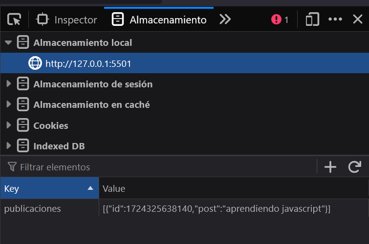

# Objetivo del proyecto

Este proyecto tiene como objetivo aprender el manejo del almacenamiento local del navegador. Al finalizar el proyecto serás capaz de almacenar datos y leerlos para mostrarlos en el documento HTML. Además, repasaremos alguno de los conceptos vistos en proyectos anteriores. El proyecto es muy sencillo (podría ser el típico TO-DO List), el usuario visualiza un área de texto donde puede escribir y al pulsar sobre el botón añadir visualizará el texto introducido. Una vez visualizado, se podrá eliminar.

## Desarrollo del proyecto

La explicación será paso a paso, se puede seguir la evolución de todas las partes siguiendo el historial de **_commits_**.

## Primer paso: comenzando el proyecto

Al igual que hemos hecho en proyectos anteriores, vamos a ir declarando alguna de las variables que va a almacenar los selectores que vamos a manejar en nuestra pequeña aplicación. También vamos a inicializar un **_Array vacío_** que va a recoger nuestras publicaciones. También añadiremos los eventos de escucha que necesitamos y las funciones que vamos a ejecutar cuando se hayan "escuchado" los eventos:

```javascript
// Variables
const formulario = document.querySelector("#formulario");
const listaPosts = document.querySelector("#lista-posts");
let posts = [];

eventListeners();
// Event Listeners
function eventListeners() {
  formulario.addEventListener("submit", nuevoPost);
}

//Funciones
function nuevoPost(e) {
  e.preventDefault();
  console.log("agregando...");
}
```

## Segundo paso: validación del formulario.

A continuación, vamos a mostrar un mensaje de alerta al usuario para evitar que se envíen publicaciones vacías. Para ello, vamos a hacer una validación dentro de la función **_nuevoPost()_**.

```javascript
function nuevoPost(e) {
  e.preventDefault();

  // Text area donde el usuario escribe
  const post = document.querySelector("#post").value;

  // validación
  if (post === "") {
    mostrarError("La publicación no puede ir vacía");
    return; //evita que se ejecuten más líneas de código
  }
}
```

Si el valor introducido por el usuario en el **_TextArea_** está vacío, ejecutaremos la función mostrarError que recibe como argumento el mensaje que queramos mostrar al usuario y a continuación, creamos la función **_mostrarError()_** tal y como hemos hecho en proyectos anteriores:

```javascript
function mostrarError(error) {
  const mensajeErrorDiv = document.querySelector(".error");

  // Verificar si hay un mensaje de error previo para evitar duplicados
  if (!mensajeErrorDiv) {
    const mensajeError = document.createElement("P");
    mensajeError.textContent = error;
    mensajeError.classList.add("error");

    //Insertarlo en el contenido
    const contenido = document.querySelector("#contenido");
    contenido.appendChild(mensajeError);

    //Elimina la alerta a los 3 segundos
    setTimeout(() => {
      mensajeError.remove();
    }, 3000);
  }
}
```

## Tercer paso: mostrar la publicación en el HTML.

Cada vez que el usuario escriba una publicación, debe añadirse al **_array post_** que habíamos declarado e inicializado como vacío al principio. Ese array lo vamos a ir llenando con cada una de las publicaciones que el usuario usando un objeto que tendrá un id y el texto introducido.

```javascript
const postObj = {
  id: Date.now(),
  post, // recuerda que es igual que poner post: post cuando los nombres de la llave y el valor son iguales
};
```

Una forma sencilla de tener un identificador único es apoyarse en el método **_now()_** que veremos en más detalle próximamente.

Mediante el **_Spread operator_** haremos una copia de las publicaciones anteriores y le añadimos la nueva publicación:

```javascript
posts = [...posts, postObj];
```

Y ahora crearemos una función para que nos genere el HTML con las publicaciones del usuario.

```javascript
function crearHTML(postObj) {
  if (posts.length > 0) {
    posts.forEach((post) => {
      // Crear el HTML
      const li = document.createElement("LI");
      // añadir el texto
      li.innerText = post.post;
      // inyectarlo en el HTML
      listaPosts.appendChild(li);
    });
  }
}
```

Como queremos que se añada la lista de publicaciones si contiene algún elemento, hacemos es validación, iteramos sobre nuestro array, creamos un elemento **_LI_** para cada publicación, en el elemento le asignamos el texto que está en el objeto y lo "pintamos" en el elemento **_listaPosts_** que habíamos declarado en nuestras variables.

Recuerda que al usar appendChild, debemos limpiar el HTML previo para evitar que nos duplique código HTML, así que crearemos la función para limpiar el HTML que ya hemos visto en anteriores proyectos:

```javascript
function limpiarHTML() {
  while (listaPosts.firstChild) {
    listaPosts.removeChild(listaPosts.firstChild);
  }
}
```

Y llamamos a esta función antes de crear el HTML:

```javascript
function crearHTML(postObj) {
    limpiarHTML();
    if(posts.length > 0) {
```

Y para mejorar la experiencia del usuario, vamos a limpiar el formulario cada vez que hagamos una nueva publicación, reiniciaremos el formulario usando el método reset():

```javascript
formulario.reset();
```

## Cuarto paso: Guardar en el almacenamiento local (Local Storage)

En este punto, vemos que la aplicación funciona correctamente, pero si recargamos la pestaña del navegador, la información se pierde. Es ahí donde entra en juego **_Local Storage_**

Cuando creamos el HTML de las publicaciones vamos a llamar a una función que vamos a llamar enviarAlStorage y que vamos a crear a continuación:

```javascript
function enviarAlStorage() {
  localStorage.setItem("publicaciones", JSON.stringify(posts));
}
```

Esta función es sencilla, para guardar las publicaciones en el almacenamiento local, usamos el método **_setItem_** le asignamos un nombre, y le pasamos la información de nuestros posts convertido en **_String_**

Ahora si recargamos el navegador, siguen sin aparecer las publicaciones, pero si abrimos las herramientas de desarrollador y vamos a la pestaña memoria (yo uso FireFox) veremos nuestro Item "Publicaciones" ahí:



Para mostrar el HTML de nuestras publicaciones cuando el elemento se carga vamos a añadir un nuevo evento de escucha que se inicie al principio y ahí obtendremos las publicaciones que están almacenadas en **_Local Storage_**

```javascript
document.addEventListener("DOMContentLoaded", () => {
  posts = JSON.parse(localStorage.getItem("publicaciones")) || [];
  crearHTML();
});
```

En este punto lo que hacemos es obtener el Item "publicaciones" mediante el método **_getItem_**, como se almacena en forma de string, debemos convertirlo a un objeto JSON, y para ello usamos **_parse_**.

Es importante tener en cuenta que si eliminamos el contenido del localStorage, y mostramos los posts en la consola, nos va a decir que su valor es "null". Si invocamos la función **_crearHTML()_** este null nos provocará un fallo, ya que en la validación de la función:

```javascript
function crearHTML(postObj) {
    limpiarHTML();
    if(posts.length > 0) {
```

No existe un método length para datos de tipo null, es un método de arrays.

## Quinto paso: Eliminar publicación del almacenamiento local

Cuando creamos el HTML que muestra el listado de las publicaciones, vamos a añadir un botón de forma dinámica para cada una de las publicaciones en la función **_crearHTML()_**:

```javascript
const btnBorrar = document.createElement("A");
btnBorrar.classList.add("borrar-post");
btnBorrar.innerText = "X";
```

Para repasar, vamos a añadir un poco de estilo para separar el botón de la publicación:

```javascript
li.style.display = "flex";
li.style.gap = "10px";
```

Inyectamos ese botón en el HTML:

```javascript
li.appendChild(btnBorrar);
```

Ahora, le tenemos que añadir la funcionalidad a ese botón, para ello, vamos a hacer que cuando el usuario haga click en ese botón, se ejecute la función **_borrarPost()_** y como debe identificar que publicación estamos tratando de eliminar, le tenemos que pasar su id:

```javascript
btnBorrar.onclick = () => {
  borrarPost(post.id);
};
```

Para finalizar, creamos la función **_borrarPost_**

```javascript
function borrarPost(id) {
  posts = posts.filter((post) => post.id !== id);
  crearHTML();
}
```
Una forma sencilla de eliminar es usando el método de arrays filter, en el cual reasignamos el valor del array ***posts***, filtrando por aquellos cuyo id sea distinto al id que le acabamos de pasar cuando hacemos click en cada una de las funciones y para que nos actualize el listado en el HTML, llamamos de nuevo a la función ***crearHTML()***.
